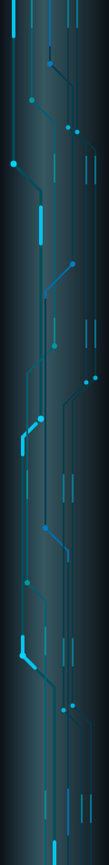

  

<table border="0" width="100%" cellpadding="0" cellspacing="0">
  <tr>
    <!-- PCB Esquerda -->
    <td width="110px" align="center" valign="top">
      
    </td>
    
    <!-- Conteudo Central -->
    <td align="center" valign="top">
      
      <!-- Digitação com largura reduzida (550) para não bugar a tela -->
      
      
      <h2 align="center">About me:</h2>
      

        Hey! I'm Danilo, a programmer and maker from Brazil passionate about hardware development, electronics, and writing low-level code just for the fun of it!  
        I enjoy building software, starting physical automation projects, and tinkering with microcontrollers.
      

      <!-- Mini-tabela para manter os tópicos alinhados à esquerda, mas no centro da tela -->
      <table border="0" cellpadding="0" cellspacing="0">
        <tr>
          <td align="left">
            • 🔭 I’m currently working on my personal hobby and IoT projects. 
            • 🌱 Studying embedded systems, low-level optimization, and C/C++. 
            • 💬 Ask me about: Arduino, ESP32, and DIY hardware. 
            • 📬 How to contact me: danilogcrf2@gmail.com 
            • ⚡ Fun fact: I used to think that Arduino uno was better than ESP32 or other MCUs (i was 6)
          </td>
        </tr>
      </table>

       
      
      <h2 align="center">🛠 Languages & skills:</h2>
      
      
        
      
      <h2 align="center">📊 GitHub Dashboard:</h2>
      
      
         
      
      
      
    </td>
    
    <!-- PCB Direita -->
    <td width="110px" align="center" valign="top">
      
    </td>
  </tr>
</table>

  

